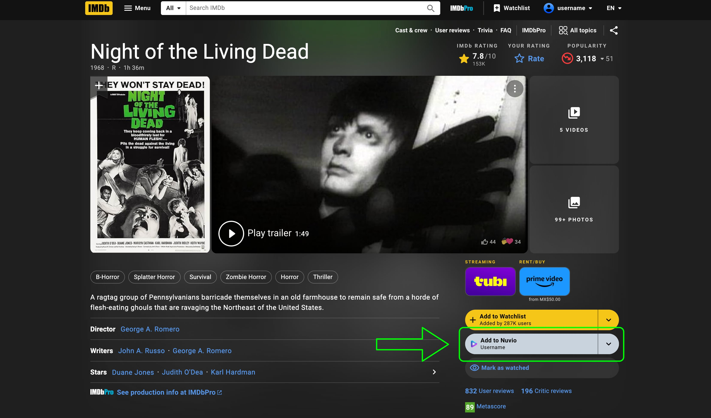
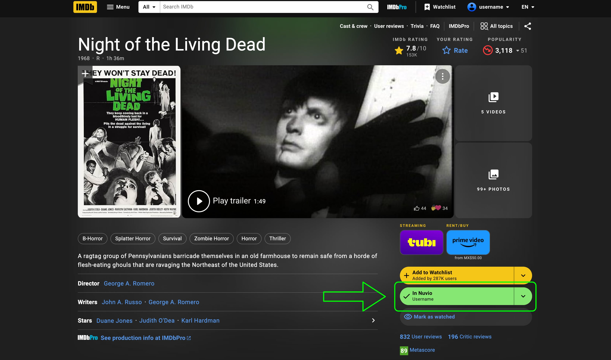
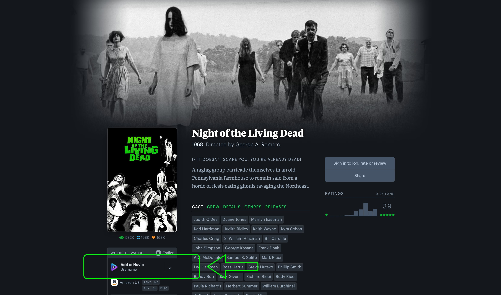

# Add to Nuvio

  

Add movies and TV series to your Nuvio library directly from IMDb, Letterboxd, Rotten Tomatoes, and TMDB. This Chrome extension adds a button to supported title pages so you can check a title's status, save it to the selected Nuvio profile, or remove it with another click.

## Features

- **Add and remove titles:** The button shows **Add to Nuvio** when a title is not in your library and **In Nuvio** when it is. Click it again to remove a saved title.
- **Choose a profile:** Use the arrow beside the button to switch between your Nuvio profiles. The selected profile name appears under the button label, and the selection is remembered.
- **See the current state:** The extension checks whether the title is already in the selected profile's library. It shows loading, success, and error states; on IMDb, the saved button turns green.
- **Site-matched buttons:** The button follows each site's visual style instead of adding a floating overlay, and keeps the original Nuvio logo. The extension icon uses the new Add to Nuvio logo.
- **Use your existing Nuvio session:** Sign in at [nuvio.tv](https://nuvio.tv/). The extension syncs that session to make library requests; it does not ask you to enter your credentials on IMDb or another title site.

## Supported sites

| Site | Where the button appears | Title matching |
| --- | --- | --- |
| IMDb | Under **Add to Watchlist** on movie and series pages | Uses the IMDb title ID from the page |
| Letterboxd | At the top of **Where to Watch** on film pages | Uses the film's IMDb link |
| Rotten Tomatoes | In **Where to Watch** on movie and TV series pages | Matches title and year against the Nuvio catalog; ambiguous matches are not added |
| TMDB | Below the poster/streaming area on movie and TV series pages | Resolves the TMDB title through the Nuvio catalog to an IMDb ID |

## Screenshots

IMDb before adding a movie:

IMDb after adding the movie to the selected profile:

Letterboxd before adding a movie:

Letterboxd after adding the movie to the selected profile:

## Install from source

1. Download or clone this repository.
2. Open `chrome://extensions` in Chrome and enable **Developer mode**.
3. Select **Load unpacked** and choose the repository folder—the folder containing `manifest.json`.
4. Open [nuvio.tv](https://nuvio.tv/), sign in, and reload that tab if it was already open.
5. Open or reload a supported movie or series page. Use the button to add or remove the title, or its arrow to choose a profile.

After replacing extension files, click **Reload** on `chrome://extensions`, then reload your open Nuvio and title tabs so Chrome runs the updated content scripts. The button requires an active Nuvio session and an internet connection.

## Permissions and data

The extension runs content scripts only on Nuvio and the supported title sites. It uses Chrome's local extension storage to keep the Nuvio session, profile information, selected profile, and a client identifier. It sends authenticated library requests to `api.nuvio.tv` and title lookup requests to `catalog.nuvio.tv`. The Nuvio session token is not sent to IMDb, Letterboxd, Rotten Tomatoes, or TMDB. The extension includes no analytics or remotely hosted executable code.

## Notes

- Letterboxd titles need an IMDb link to be identified.
- Rotten Tomatoes and TMDB titles are added only when the extension can resolve a reliable matching ID; otherwise it shows an error instead of risking the wrong title.
- This is an independent, unofficial helper. It is not affiliated with or endorsed by Nuvio, IMDb, Letterboxd, Rotten Tomatoes, or TMDB.
